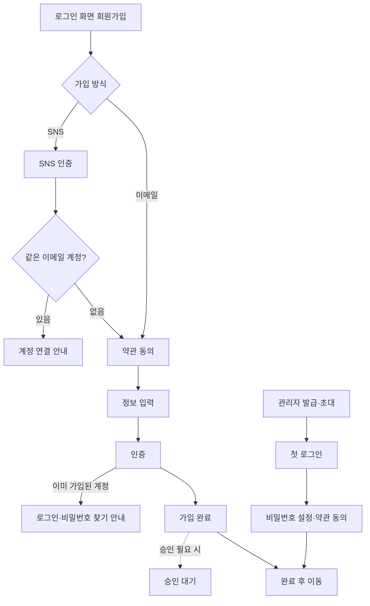

## 1. 목적
신규 사용자가 최소한의 입력으로 계정을 만들고, 서비스는 필요한 동의·확인을 빠짐없이 받도록 가입 절차를 통일한다.
- 범위: 진입 → 약관 동의 → 정보 입력 → 인증 → 완료
- 다른 정책으로 넘김: 세션·로그인(→ 로그인), 비밀번호 규칙(→ 비밀번호), 보관·파기·마스킹(→ 개인정보 처리), 탈퇴(2단계)

## 2. 규칙 표
| 단계 | 항목 | 내용 | 등급 | {변수} |
|---|---|---|---|---|
| 진입 | 가입 방식 | 서비스 유형에 맞는 방식을 1개 이상 제공한다. {가입 방식: 이메일 자가 가입} | 필수 | 가입 방식 (이메일 자가 가입 / 관리자 발급 / 초대 링크 / SNS 연동) |
| 진입 | 진입 경로 | 로그인 화면 하단과 헤더에 '회원가입'을 둔다. 회원 전용 기능 접근 시 로그인 화면으로 보내고 그 안에서 가입을 안내한다 | 권장 | — |
| 진입 | SNS 간편 가입 | {SNS 종류: 카카오·네이버·구글}을 지원한다. 같은 이메일 계정이 이미 있으면 새로 만들지 않고 계정 연결 여부를 묻는다 | 선택 | SNS 종류 |
| 진입 | 관리자 발급·초대 (B2B·플랫폼) | 관리자가 계정을 만들거나 초대하면 사용자는 첫 로그인 때 비밀번호 설정과 약관 동의를 마쳐야 이용할 수 있다. 초대 링크 유효 기간 {초대 유효: 7일} | 선택 | 초대 유효 |
| 동의 | 필수·선택 구분 | 약관을 필수/선택으로 나눠 표기하고, 항목마다 '전문 보기'를 둔다 | 필수 | — |
| 동의 | 필수 약관 | {필수 약관: 이용약관, 개인정보 수집·이용}에 동의하지 않으면 다음 단계 버튼을 비활성화한다 | 필수 | 필수 약관 |
| 동의 | 선택 약관 | {선택 약관: 마케팅 정보 수신(이메일·SMS·푸시 채널별)}은 가입 단계의 약관 동의 화면에서 받는다. 동의하지 않아도 가입할 수 있고 기본값은 미체크다 | 필수 | 선택 약관 |
| 동의 | 전체 동의 | '전체 동의'를 제공하되 선택 항목이 포함됨을 문구로 밝히고, 개별 해제를 허용한다 | 권장 | — |
| 동의 | 연령 확인 (B2C·공공) | 만 14세 미만은 {연령 정책: 가입 불가}로 처리한다. 가입을 허용하면 법정대리인 동의 단계를 추가한다 | 필수 | 연령 정책 (가입 불가 / 법정대리인 동의) |
| 입력 | 수집 최소화 | 가입에 꼭 필요한 항목만 받는다. {필수 입력: 이메일, 비밀번호, 이름}. 나머지는 가입 후 프로필에서 받는다 | 필수 | 필수 입력 |
| 입력 | 아이디 | {아이디 형식: 이메일}. 중복 여부는 입력을 마친 직후(포커스 이동 시) 확인한다 | 권장 | 아이디 형식 |
| 입력 | 비밀번호 | 규칙은 비밀번호 정책을 따른다. 입력 중 조건 충족 여부를 실시간 표시하고 보기/숨기기를 제공한다 | 필수 | — |
| 입력 | 비밀번호 확인 칸 | 보기/숨기기가 있으면 생략할 수 있다 | 선택 | — |
| 입력 | 오류 표시 | 오류는 필드 바로 아래 문장으로 표시하고, 제출 시 첫 오류 필드로 포커스를 옮긴다. 색만으로 구분하지 않는다 | 필수 | — |
| 입력 | 입력값 유지 | 오류·뒤로 가기 후에도 입력값을 유지한다(비밀번호 제외) | 권장 | — |
| 인증 | 본인·이메일 확인 | {인증 방식: 이메일 인증 코드}. 인증 전에는 가입이 완료되지 않는다 | 권장 | 인증 방식 (이메일 코드 / 휴대폰 본인확인 / 없음) |
| 인증 | 인증 코드 | 유효 시간 {유효 시간: 5분}, 남은 시간 표시, 재발송 {재발송 제한: 1분에 1회 · 하루 5회} | 권장 | 유효 시간, 재발송 제한 |
| 인증 | 중복 가입 방지 | 같은 이메일(휴대폰 본인확인 시 같은 사람)로 계정은 1개다. 이미 있으면 로그인·비밀번호 찾기로 안내한다 | 필수 | — |
| 보안 | 자동 가입 방지 | {자동 가입 방지: CAPTCHA}, 같은 IP에서 {가입 시도 제한: 10분에 5회} 초과 시 차단 | 권장 | 자동 가입 방지, 가입 시도 제한 |
| 완료 | 가입 완료 | 완료 안내 후 {완료 후 이동: 자동 로그인 → 메인}. 가입 완료 이메일은 {완료 메일: 발송} | 권장 | 완료 후 이동, 완료 메일 |
| 완료 | 승인 대기 (B2B·플랫폼) | 관리자 승인이 필요하면 '승인 대기' 상태를 안내하고, 승인·반려 시 알림을 보낸다 | 선택 | — |
| 운영 | 미완료 가입 정리 | 인증을 마치지 않은 가입 정보는 {미완료 보관: 24시간} 후 삭제한다 | 권장 | 미완료 보관 |
| 운영 | 동의 이력 | 동의 항목·일시·약관 버전을 기록한다 (개인정보 처리 정책과 연결) | 필수 | — |

## 3. 흐름

- 단계 표시: 3단계 이상이면 상단에 진행 단계(예: 1 약관 동의 · 2 정보 입력 · 3 인증)를 보여준다

## 4. 예시 문구 (합니다체)
| 상황 | 문구 |
|---|---|
| 전체 동의 | 전체 동의합니다. (선택 항목 포함) |
| 필수 미동의 | 필수 약관에 동의해야 가입할 수 있습니다. |
| 이메일 형식 오류 | 이메일 형식이 올바르지 않습니다. 예: name@example.com |
| 이메일 중복 | 이미 가입된 이메일입니다. 로그인하거나 비밀번호를 찾아 주십시오. |
| 인증 코드 발송 | {이메일}로 인증 코드를 보냈습니다. {유효 시간} 안에 입력해 주십시오. |
| 인증 코드 오류 | 인증 코드가 일치하지 않습니다. 다시 확인해 주십시오. |
| 인증 시간 만료 | 인증 시간이 지났습니다. 인증 코드를 다시 받아 주십시오. |
| 재발송 제한 | 잠시 후 다시 요청해 주십시오. ({남은 시간} 후 가능) |
| 연령 제한 | 만 14세 미만은 가입할 수 없습니다. |
| SNS 계정 연결 | 같은 이메일로 가입된 계정이 있습니다. 기존 계정에 연결하시겠습니까? |
| 가입 완료 | 회원가입이 완료되었습니다. |
| 승인 대기 | 가입 신청이 접수되었습니다. 관리자 승인 후 이용할 수 있습니다. |

## 5. 체크리스트
- [ ] 가입 방식과 {변수} 값을 프로젝트에 맞게 정했는가
- [ ] 필수·선택 약관이 구분되고, 선택 약관 기본값이 미체크인가
- [ ] 연령 확인이 필요한 서비스(B2C·공공)인지 확인했는가
- [ ] 필수 입력 항목이 최소인가 (가입 후 받아도 되는 항목 제외)
- [ ] 오류가 필드 아래 문장으로 표시되고 첫 오류 필드로 포커스가 가는가
- [ ] 중복 가입 시 로그인·비밀번호 찾기로 이어지는가
- [ ] 인증 코드 유효 시간·재발송 제한이 화면에 보이는가
- [ ] 동의 이력(항목·일시·버전)이 저장되는가

<!-- 작성자용 메모 (화면에 보이지 않음)
## 6. 검토 필요 (초안 → 확정 전)
- 확정 (2026-10-05): 마케팅 수신 동의는 가입 단계에서 받는다
1. 공공 서비스 기본 인증 방식을 '휴대폰 본인확인'으로 둘까? (현재 이메일 코드)
2. 비밀번호 확인 칸: 선택(보기/숨기기로 대체) 유지?
-->
